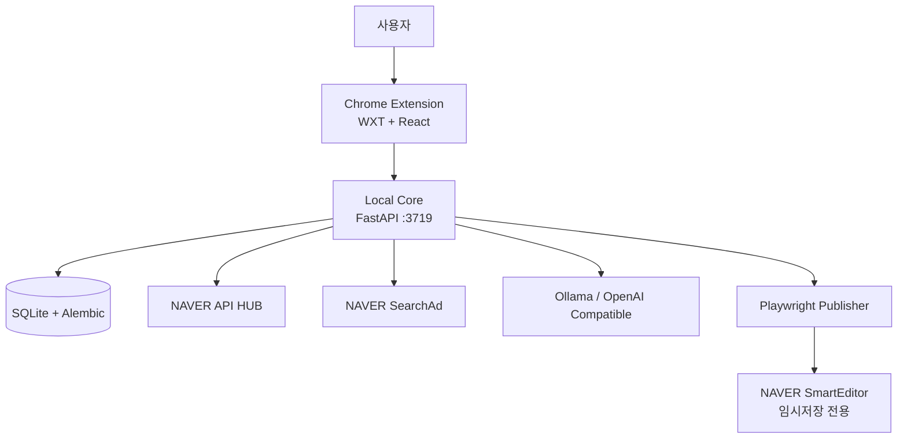

<div align="center">

# 🟢 Naver Content OS


### 최신 키워드 발견부터 근거 기반 콘텐츠 기획, AI 초안, SmartEditor 임시저장까지

**네이버 콘텐츠 제작 전 과정을 하나의 로컬 워크스페이스로 연결하는 Chrome Extension + Local Core**

[](https://github.com/coreline-ai/naver-contents-os/actions/workflows/verify.yml)


[핵심 기능](#-핵심-기능) · [최신 키워드](#-최신-키워드-추천) · [사용 흐름](#-콘텐츠-운영-흐름) · [빠른 시작](#-빠른-시작) · [검증](#-검증)

</div>

> [!IMPORTANT]
> Naver Content OS는 **자동 공개 발행 도구가 아닙니다.** SmartEditor에는 제목·본문·태그를 입력하고 **임시저장까지만** 수행합니다. 최종 검토와 공개 발행은 사용자가 직접 진행합니다.

---

## 🚀 핵심 기능

| | 기능 | 핵심 가치 |
|---:|---|---|
| 🔥 | **최신 키워드 추천** | 일반·지역·쇼핑·뉴스별 후보와 7일 상승률, 뉴스 표본, 최신성 점수를 제공합니다. |
| 🔎 | **연관 키워드 탐색** | 입력 중 추천, SearchAd 연관어, Top 8 키워드, 클릭 즉시 재분석을 지원합니다. |
| 🕸️ | **키워드 기회 분석** | 2단계 키워드 맵, Opportunity Score, 검색 의도, 질문, 클러스터를 생성합니다. |
| 📊 | **Research Workspace** | 급상승·상업성·타깃·Watchlist·지역·쇼핑·이미지·광고 성과를 전체화면에서 분석합니다. |
| 🧾 | **FactPack 근거 관리** | 사용할 근거를 직접 선택·승인하고 Snapshot부터 초안까지 lineage를 보존합니다. |
| 🧭 | **15편 콘텐츠 플랜** | 키워드 분석을 콘텐츠 유형과 작성 순서가 포함된 시리즈 계획으로 변환합니다. |
| ✍️ | **구조·AI 초안** | LLM 없는 skeleton과 Ollama/OpenAI 호환 AI 초안을 선택적으로 생성합니다. |
| 🗂️ | **콘텐츠 운영 OS** | 오늘의 작업, Draft 작업함, 버전 이력, 발행 등록부, 노후 콘텐츠를 관리합니다. |
| 🤖 | **SmartEditor 임시저장** | 최신 Draft를 네이버 편집기에 입력하고 임시저장 성공 신호까지 검증합니다. |
| 🔐 | **Local-first** | DB·token·작업 이력을 로컬에 보존하고 API quota와 민감정보를 보호합니다. |

---

## 🔥 최신 키워드 추천

Naver Content OS는 단순 연관 검색어 목록을 넘어, **지금 작성할 만한 최신 주제 후보**를 찾도록 설계되었습니다.

### 입력과 동시에 연관 키워드 발견

- 최근 분석 키워드는 입력 즉시 표시
- 한글/CJK 2자 또는 그 외 3자부터 700ms 뒤 SearchAd 추천 결합
- 핵심 연관 키워드 Top 8을 분석 화면 상단에 배치
- 추천 키워드를 누르면 해당 키워드로 즉시 재분석

### 분야별 최신 키워드

| 분야 | 분석 방식 |
|---|---|
| 🌐 **일반** | 입력 주제를 중심으로 연관 후보와 검색 추세를 비교합니다. |
| 📍 **지역** | 지역명과 주제를 결합해 지역 관심 키워드 후보를 찾습니다. |
| 🛍️ **쇼핑** | Shopping Insight와 SearchAd 근거를 이용해 상품 관심 변화를 확인합니다. |
| 📰 **뉴스** | 최신 뉴스 검색 결과와 검색 추세를 결합해 이슈성 후보를 찾습니다. |

### 최근 7일 상승률

- KST 기준 오늘을 제외한 완료된 최근 14일 사용
- **최근 7일 vs 이전 7일**의 같은 series 안에서 변화율 계산
- `상승`, `신규`, `유지`, `하락` 방향 표시
- Trend 관측이 부족하면 0으로 처리하지 않고 `계산 불가` 표시

### 최신성 점수 `freshness-v1`

```text
검색 추세 변화 + 최근 뉴스 표본 + 데이터 관측률 → 최신성 점수
```

- 최신순 뉴스 결과 최대 100건에서 최근 7일 링크를 중복 제거
- 추세 점수와 뉴스 구성 점수를 함께 사용
- 결과에 관측률, 신뢰도, 부분 데이터 여부 표시
- 공급자 실패나 결측은 0점이 아니라 `부분 데이터`로 구분

> [!NOTE]
> 최신 키워드는 사용자가 **`최신 수집`** 을 눌렀을 때 외부 데이터를 조회합니다. 입력 주제 기반 추천이며 NAVER 공식 실시간 인기 검색어 순위는 아닙니다.

---

## 🔎 키워드 인텔리전스

### Opportunity Graph

- seed → 1차 30개 → 주요 seed 5개의 2차 확장
- 최대 80개 키워드 노드 구성
- 검색량, 광고 경쟁, Organic 결과, 상대 Trend를 출처별로 보존
- Opportunity Score와 coverage/confidence 제공

### 검색 의도 `intent-v1`

| 의도 | 예시 목적 |
|---|---|
| `informational` | 개념·정보 탐색 |
| `howto` | 방법·절차 확인 |
| `eligibility` | 조건·자격 확인 |
| `troubleshooting` | 문제 해결 |
| `comparison_review` | 비교·후기 탐색 |
| `commercial` | 구매·가격·혜택 탐색 |
| `local_visit` | 지역·방문 탐색 |
| `other` | 기타 의도 |

의도별 보드에서는 SearchAd PC/MO 검색량, 광고 경쟁, Organic 문서 수, 상대 Trend, 기존 콘텐츠 상태를 하나로 합산하지 않고 나란히 표시합니다.

### 질문·클러스터·점수

- 검색 근거에서 사용자가 궁금해할 질문 추출
- 유사 키워드를 콘텐츠 주제별 클러스터로 정리
- Opportunity Score v1과 근거 coverage/confidence 제공
- 오타 교정과 민감 키워드 Gate를 분석 전에 실행

---

## 📊 Research Workspace

사이드패널에서 **`Research Workspace 전체화면 열기`**를 눌러 실행합니다.

| 화면 | 핵심 목적 | 명시적 외부 호출 |
|---|---|---:|
| 🧭 오늘의 작업 | 실패·검수·미발행·노후·상승·광고 공백 우선순위 추천 | 없음 |
| 🗃️ 콘텐츠 작업함 | Draft 검색·상태 변경·이어쓰기·발행 등록 | 없음 |
| 🌐 발행 콘텐츠 | 실제 공개 URL 등록과 노후 콘텐츠 관리 | 없음 |
| 🧾 근거 브리프 | FactPack 근거 선택·버전 저장·승인 | 없음 |
| 🎯 의도별 키워드 | 의도별 연관어와 콘텐츠 상태 비교 | 없음 |
| 🕸️ 키워드 맵 | 최대 80개 노드의 2단계 확장 | 최대 12회 |
| 🔥 급상승 | 분야별 7일 비교와 뉴스 최신성 분석 | 최대 10회 |
| 💰 상업성 | 평균 순위·최소 노출·중간 입찰·성과 estimate | 4회 |
| 👥 타깃 | 기기·성별·연령 상대 추세 | 최대 15회 |
| ⭐ Watchlist | 저장 키워드의 동일 조건 Snapshot 수동 비교 | 키워드당 약 2회 |
| 📍 특화 분석 | 지역·Shopping Insight·이미지 참고 결과 | mode별 1회 |
| 📣 광고 성과 | SearchAd 계정 성과와 콘텐츠 공백 탐색 | 최대 23회 |

외부 API 호출은 사용자가 버튼을 눌러야 시작됩니다. Watchlist 자동 갱신과 백그라운드 스케줄러는 없습니다.

Workspace URL에는 `keyword`와 `snapshot_id`만 전달합니다. API Secret, 본문, 전체 provider 응답은 URL이나 Extension storage에 저장하지 않습니다.

---

## 🧾 근거 기반 콘텐츠 제작

### FactPack 근거 브리프

- Keyword Snapshot에서 검색량, Trend 요약, 질문, 검색 결과 metadata, 기회 점수 추출
- 사용할 근거만 사용자가 선택하고 승인
- 선택 변경과 승인을 새 `FactPackVersion`으로 누적
- 승인된 버전의 선택 근거만 AI prompt에 전달
- Draft에 `snapshot → FactPack → 승인 버전 → 초안 버전` lineage 저장

전체 provider 응답, 검색 결과 본문, API Secret은 FactPack이나 AI prompt에 복사하지 않습니다.

### 15편 콘텐츠 플랜

- Opportunity Score와 키워드 클러스터를 최대 15편의 시리즈로 변환
- 제목 방향, 검색 의도, 콘텐츠 역할, 작성 순서 제공
- `HOWTO`, `POLICY`, `REVIEW`, `COMPARISON`, `HOMEFEED`, `PRODUCT`, `NEWS`, `SERIES` 지원

### 구조·AI 초안

- 모든 BlogType에서 LLM 없는 section skeleton 생성
- Ollama 기반 로컬 AI 초안
- 명시적으로 설정한 OpenAI 호환 endpoint 지원
- 사이드패널에서 제목·본문 수정
- 기존 내용을 덮어쓰지 않고 새 Draft 버전으로 저장

---

## 🗂️ 콘텐츠 운영 기능

| 기능 | 동작 |
|---|---|
| **오늘의 작업** | 실패 복구 → 검수 대기 → 임시저장 후 미발행 → 노후 콘텐츠 → 상승 후보 → 광고 공백 순으로 추천합니다. |
| **콘텐츠 작업함** | 제목·키워드 검색, 상태 필터, cursor pagination, Draft 이어쓰기를 제공합니다. |
| **최근 작업 계속** | Extension을 다시 실행해도 최근 Draft와 최신 버전을 불러옵니다. |
| **발행 콘텐츠 등록부** | `missing`, `draft_only`, `published`, `stale`, `archived` 상태로 실제 공개 결과를 관리합니다. |
| **노후 콘텐츠 감지** | 공개 후 90일이 지난 콘텐츠를 `stale`로 표시합니다. |
| **PC·모바일 도넛** | 정확한 SearchAd 월간 검색량 두 값이 모두 있을 때만 비율을 계산합니다. |

`오늘의 작업`, Draft 목록, FactPack, 의도 보드는 로컬 DB만 사용하므로 화면을 여는 것만으로 외부 API quota를 소비하지 않습니다.

---

## 🤖 SmartEditor 임시저장

SmartEditor 자동화는 컴퓨터 화면의 좌표를 무작정 클릭하는 방식이 아니라, 편집기 상태와 입력영역을 확인한 뒤 단계적으로 실행합니다.

1. 지정 Draft의 최신 버전을 불러옵니다.
2. NAVER 로그인과 SmartEditor 상태를 Health Check합니다.
3. 비동기 editor canvas가 준비될 때까지 기다립니다.
4. 제목·본문·태그 입력영역과 편집 가능 상태를 확인합니다.
5. Draft 제목·본문·태그를 입력합니다.
6. NAVER 임시저장을 실행합니다.
7. 완료 알림과 저장 상태 DOM 변화를 함께 검증합니다.
8. 성공 시 `draft_saved`, 실패 시 `failed`와 마스킹된 증거를 기록합니다.

> [!CAUTION]
> 공개 버튼은 자동으로 누르지 않습니다. `발행 완료 등록`도 사용자가 실제 공개 URL, 제목, 공개 사실을 확인한 뒤 명시적으로 실행해야 합니다.

---

## 🔄 콘텐츠 운영 흐름

```mermaid
flowchart LR
    A[키워드 입력] --> B[연관어·최신 키워드 추천]
    B --> C[급상승·기회 분석]
    C --> D[Keyword Snapshot]
    D --> E[FactPack 선택·승인]
    E --> F[15편 콘텐츠 플랜]
    F --> G[구조 또는 AI 초안]
    G --> H[Draft 편집·버전 저장]
    H --> I[SmartEditor 입력]
    I --> J[NAVER 임시저장]
    J --> K[사용자 검토·직접 공개]
    K --> L[발행 완료 등록]
```



---

## 🖥️ Chrome Extension 화면

### 사이드패널

- 입력 중 연관 키워드 추천
- 연관 키워드 / 급상승 키워드 상단 탭
- 키워드 분석, 상대 Trend, 질문, 클러스터
- 15편 콘텐츠 플랜
- 구조/AI 초안 생성과 Draft 편집
- 최근 작업 이어쓰기
- SmartEditor 임시저장 Job 시작과 상태 확인
- Blog Inspector와 Browser SERP 근거 수집

### 전체화면 Workspace

- 오늘의 작업과 콘텐츠 작업함
- 발행 콘텐츠 등록부
- FactPack 근거 브리프
- 의도별 키워드 보드
- 키워드 맵, 급상승, 상업성, 타깃, Watchlist
- 지역·쇼핑·이미지 특화 분석
- SearchAd 계정 성과와 콘텐츠 공백

---

## 🚀 빠른 시작

### 요구 환경

| 도구 | 버전 |
|---|---|
| Node.js | `>=24 <25` |
| pnpm | `11.13.1` |
| Python | `>=3.12 <3.13` |
| Python 패키지 관리 | `uv` |
| Browser | Google Chrome / Manifest V3 |
| 선택 사항 | Ollama와 설치된 로컬 모델 |

### 1. 의존성 설치

```bash
uv sync
pnpm install
cp .env.example .env
```

NAVER API HUB, SearchAd, LLM 설정은 `.env.example`과 [API 및 계정 설정](./docs/10_api_and_account_setup.md)을 참고하세요. 실제 인증값은 `.env`에만 입력합니다.

### 2. Local Core 실행

```bash
uv run uvicorn app.main:app \
  --app-dir apps/local-core \
  --host 127.0.0.1 \
  --port 3719
```

첫 실행 시 DB migration이 적용되고 `data/local_core_token.txt`가 권한 `600`으로 생성됩니다.

### 3. Chrome Extension 빌드·설치

```bash
pnpm build:ext
```

1. Chrome에서 `chrome://extensions`를 엽니다.
2. 우측 상단 **개발자 모드**를 켭니다.
3. **압축해제된 확장 프로그램 로드**를 누릅니다.
4. `apps/extension/.output/chrome-mv3`를 선택합니다.
5. Naver Content OS 아이콘을 눌러 사이드패널을 엽니다.
6. 설정에 `data/local_core_token.txt`의 **경로가 아닌 파일 내용**을 입력합니다.

### 4. Extension 업데이트

```bash
pnpm build:ext
```

빌드 후 `chrome://extensions`의 **Naver Content OS 카드에서 새로고침(↻)** 을 누르고, 열려 있던 사이드패널을 닫았다가 다시 엽니다.

> [!TIP]
> 확장 관리 카드의 모양은 업데이트 전후가 거의 같습니다. 실제 변경 사항은 Naver Content OS **사이드패널**과 **Research Workspace**에서 확인하세요.

### 5. AI 초안 준비 · 선택 사항

```bash
ollama pull qwen3:8b
```

기본 `LLM_PROVIDER=local`은 Ollama를 사용합니다. `openai_compat`은 `.env`에서 명시적으로 설정한 경우에만 활성화됩니다.

---

## 📝 SmartEditor 실행 준비

Chrome 136+에서는 기본 Chrome profile에 remote debugging을 사용할 수 없으므로 전용 profile을 사용합니다.

```bash
pnpm build:ext
./scripts/start_chrome_automation.sh
```

스크립트가 다음 항목을 준비합니다.

- `data/chrome-automation-profile` 전용 Chrome profile
- `127.0.0.1:9222` CDP endpoint
- 최신 `apps/extension/.output/chrome-mv3` production extension

열린 별도 Chrome에서 네이버에 한 번 로그인한 뒤 사이드패널에서 **`최신 버전 임시저장 시작`** 을 실행합니다.

CLI 경로도 지원합니다.

```bash
uv run python scripts/run_publish.py \
  --keyword "키워드" \
  --blog-id "내블로그ID" \
  --tags "태그1,태그2" \
  --no-llm
```

UI와 CLI 모두 공개 발행하지 않습니다. 임시저장 성공 신호를 확인하지 못하면 Job은 실패 처리되고 마스킹된 증거가 `data/publisher-artifacts/`에 저장됩니다.

---

## 🔐 Local-first와 안전장치

- Local Core는 기본적으로 `127.0.0.1:3719`에서만 실행
- 모든 `/v1/*` 요청에 `X-Local-Token` 요구
- `.env`, token, SQLite DB, Publisher evidence를 Git 추적에서 제외
- provider별 RPS, 일·월 quota guard, TTL cache, `Retry-After` 처리
- source provenance, 수집 시각, cache, freshness 상태 보존
- SearchAd 계정 API는 조회 중심이며 생성·수정·삭제 자동화 미구현
- 외부 호출은 사용자의 명시적인 버튼 동작으로만 시작
- 민감 키워드와 오타를 분석 전에 확인

---

## 🧩 시스템 구성



| 영역 | 기술 / 역할 |
|---|---|
| Extension | WXT, React 19, TypeScript, TanStack Query, Zustand, Tailwind CSS |
| Local Core | FastAPI, Pydantic, SQLAlchemy, Alembic |
| Local Data | SQLite, versioned Snapshot·FactPack·Draft·PublishedContent |
| Intelligence | Keyword scoring, question extraction, clustering, intent classification |
| Provider | NAVER API HUB, SearchAd, Ollama, OpenAI-compatible endpoint |
| Publisher | Playwright, SmartEditor Health Check, 입력, 임시저장 검증 |

### 주요 디렉터리

```text
apps/extension/       Chrome MV3 사이드패널과 Research Workspace
apps/local-core/      로컬 REST API와 데이터 서비스
packages/contracts/   Extension ↔ Local Core TypeScript 계약
python/intelligence/  점수·질문·클러스터·검색 의도 분석
python/planner/       콘텐츠 시리즈와 초안 구조 생성
python/providers/     NAVER·SearchAd·LLM provider gateway
python/publisher/     SmartEditor 임시저장 자동화
tests/                Python unit·integration tests
docs/                 설계·API·보안·구현 분석 문서
dev-plan/             단계별 구현 계획과 진행 기록
```

---

## 📊 데이터 해석 기준

- Search Trend와 Shopping Insight는 요청 범위마다 독립적으로 정규화된 **상대지수**입니다.
- PC·모바일 검색량 중 하나라도 결측·마스킹되면 비율을 계산하지 않습니다.
- SearchAd 검색량·광고 경쟁, Organic 문서 수, 상대 Trend는 서로 다른 근거이므로 하나의 절대 순위처럼 합산하지 않습니다.
- 뉴스 값은 최신순 최대 100건에서 최근 7일 링크를 중복 제거한 **표본**이며 전체 기사 발생량이 아닙니다.
- 데이터 관측이 부족하거나 provider가 실패하면 0점 대신 `부분 데이터` 또는 `계산 불가`로 표시합니다.
- 이미지 검색 결과는 참고용이며 이미지 재사용 권리를 보장하지 않습니다.

---

## ✅ 검증

```bash
./scripts/verify_all.sh          # unit·integration·typecheck·production build
./scripts/verify_all.sh --live   # NAVER API live smoke 포함

uv run python scripts/verify_api_hub.py --research
uv run python scripts/verify_searchad.py --research "러닝화"
```

2026-09-03 기준:

| 검증 항목 | 결과 |
|---|---:|
| Python non-live | ✅ `186 passed` |
| Extension Vitest | ✅ `47 passed` |
| 전체 자동 테스트 | ✅ **233 passed** |
| TypeScript | ✅ 통과 |
| Production build | ✅ `372.33KB` |
| Alembic migration | ✅ clean upgrade 및 downgrade/upgrade 통과 |
| Runtime/Secret 추적 검사 | ✅ 통과 |
| SmartEditor 실사용 | ✅ 제목·본문 입력 및 NAVER 임시저장 확인 |
| 자동 공개 발행 | ⛔ 제품 범위 외 |

기본 검증은 외부 NAVER API, LLM, Chrome, SmartEditor를 호출하지 않습니다. `--live` 검증은 실제 API quota를 사용할 수 있습니다.

---

## 📌 현재 제품 범위

### ✅ 구현됨

- 연관 키워드와 분야별 최신 키워드 추천
- 7일 상승률, 뉴스 표본, 최신성 점수
- 키워드 맵, Opportunity Score, 검색 의도, 질문, 클러스터
- Research Workspace와 분야별 전문 분석
- 콘텐츠 15편 플랜과 구조/AI 초안
- FactPack 승인 근거와 Draft lineage
- Draft 버전·작업함·오늘의 추천·발행 콘텐츠 등록부
- SmartEditor 제목·본문·태그 입력과 임시저장 검증
- 로컬 인증, cache, quota, provenance, secret 추적 방지

### ⛔ 포함하지 않음

- 자동 공개 발행
- 이미지 자동 업로드
- 댓글·공감 자동화
- 다계정 운영 자동화
- Watchlist 백그라운드 자동 갱신
- SearchAd 캠페인·광고그룹·키워드 생성·수정·삭제

---

## 📚 문서

- [문서 전체 인덱스](./docs/INDEX.md)
- [프로젝트 개요와 제품 범위](./docs/01_project_overview.md)
- [키워드 분석과 Opportunity Score](./docs/03_keyword_research_and_scoring.md)
- [SmartEditor 자동화 핵심과 리스크](./docs/05_smarteditor_automation_core.md)
- [API 및 계정 설정](./docs/10_api_and_account_setup.md)
- [API 계약과 Smoke Test](./docs/12_api_contracts_and_smoke_tests.md)
- [구현 사항 전문가 분석](./docs/14_implementation_expert_review.md)
- [현재 개발 계획](./dev-plan/implement_20260903_083733.md)
- [최신 HANDOFF](./HANDOFF.md)

---

<div align="center">

**Research with evidence · Draft with lineage · Publish with human control**

</div>
