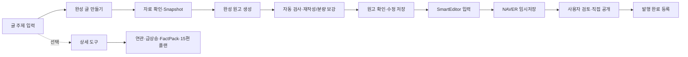
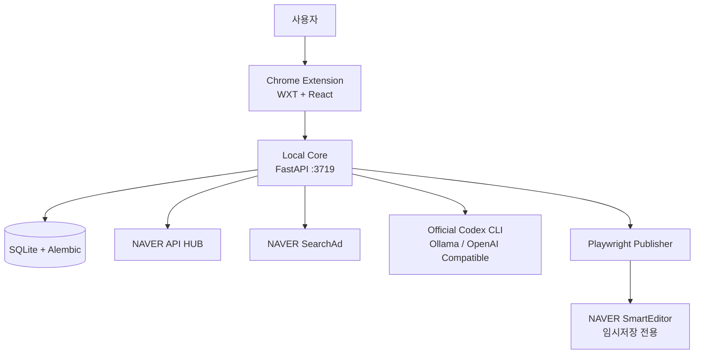

<div align="center">

# 🟢 Naver Content OS


### 주제 입력부터 완성 글 작성, 참고 사진 탐색, SmartEditor 임시저장까지

**네이버 콘텐츠 제작 전 과정을 하나의 로컬 워크스페이스로 연결하는 Local Web(전환 중) + Chrome Extension + Local Core**

[](https://github.com/coreline-ai/naver-contents-os/actions/workflows/verify.yml)


[핵심 기능](#-핵심-기능) · [완성 글 작성](#️-완성-글-자동-작성) · [최신 키워드](#-최신-키워드-추천) · [사용 흐름](#-콘텐츠-운영-흐름) · [빠른 시작](#-빠른-시작)

</div>

> [!IMPORTANT]
> Naver Content OS는 **자동 공개 발행 도구가 아닙니다.** SmartEditor에는 제목·본문·태그를 입력하고 **임시저장까지만** 수행합니다. 최종 검토와 공개 발행은 사용자가 직접 진행합니다.

### 현재 개발 상태 — 2026-10-03

- **Ego Lite P0 진행 중:** 현재 브라우저에서 응답한 확장에만 작업을 고정하고, 다른 브라우저의 heartbeat나 같은 블로그 탭을 준비 완료로 오인하지 않도록 보강했습니다. 앱 설정과 작성 화면에서 연결·빌드를 다시 확인할 수 있습니다.
- 최신 자동 검증 **637 PASS**. 실제 Ego 확장 설치·네이버 저장 인수는 아직이며, 다음 단계는 [Ego 기반 P0~P3 계획](dev-plan/implement_20261003_131549.md)을 따릅니다.
- 확장 설치 경로는 `apps/extension/dist/chrome-mv3`입니다. 설치/갱신 후 웹 페이지도 새로고침하세요. 서버는 `pnpm app:start --no-open`으로 시작해 원하는 브라우저에서 직접 열 수 있습니다.


- 현재 Chrome 확장 명령 브리지, 버전별 이미지 등록/안내 그림 생성/업로드, 저장본 재열기 검증 코드가 있습니다. 웹의 현재 페이지 분석 자료 수집 연결은 별도 잔여입니다.
- 안전성 보강 작업: 실행 회차·작업 점유·재시도 단계·고정 이미지 목록·기존 글 보호·입력/저장 확인·작성 화면 경합을 검증합니다.
- **자동 테스트는 실제 네이버 저장 성공의 증거가 아닙니다.** 이번 작업 전 로컬 이력은 검증 완료 저장 0건이며, 실제 계정 인수 전에는 앱 단독 1회 성공으로 표시하지 않습니다.
- 최신/급상승 추천은 입력 주제 기반 후보입니다. 전체 분야의 실시간 인기어 순위가 아니며, 앱 안내 그림 생성도 이미지 AI 모델 생성과 다릅니다.
- 진행 순서와 완료/미완료 근거: [안정화 및 잔여 개발 계획](dev-plan/implement_20261001_214011.md).

Chrome 없이 임시저장 로직을 다시 검수하려면:

```bash
pnpm test:publisher
```

별도 임시 DB의 HTTP 상태 계약, 가짜 debugger의 입력/업로드/재열기, 작성 UI 경합을 검사합니다. 운영 DB·실제 네이버 계정·외부 AI/API를 실행하지 않으며, 실제 Chrome의 전체 앱 E2E나 실계정 인수 성공을 증명하는 명령은 아닙니다.

---

## 🖥️ 확장 없이 사용하는 웹 작업실 — 전환 진행 중

`pnpm app:start`로 실행한 뒤 [로컬 작업실](http://127.0.0.1:3719/app/)에 연결합니다. 실행기의 **5분·1회용 코드**를 입력하며 긴 토큰을 복사할 필요가 없습니다.

- **사용 가능:** 완성 글 생성, 제목·본문 편집, 버전 저장/충돌 확인, 원고 검색·보관/복원, 근거 승인·15편/8유형 플랜, 오늘 할 일, 성과 개선 원고 연결, 네이버 임시저장 요청·상태·복구, 최신·급상승/연관 키워드, 맵·의도·독자·입찰 참고, 관심 키워드, 지역·쇼핑·참고 사진, 4종 성과 표 가져오기·채널/기간별 집계·개선 상태·추적 링크·광고 계정 성과
- **화면 테마:** 앱 설정 → 화면 테마에서 시스템·라이트·다크 선택. 브라우저별 자동 저장, 새로고침 유지, 작업 중 입력 보존. 웹 작업실에 적용하며 Chrome 자체·네이버 편집기·사진은 바꾸지 않습니다.
- **아직 이관 중:** 확장 현재 탭 수집의 웹 연결, 정식 격리 샘플 환경·전체 인수
- 기존 확장 기능은 그대로 유지합니다. 웹 전환 상태는 **P0·P1·P2-A·P2-B 구현 및 자동 검증 완료 / P2-C·P3 남음**입니다. 실제 모델 품질·네이버 웹 저장의 새 인수는 별도입니다.

[다크 테마 개발·검증 계획](dev-plan/implement_20260906_230626.md) · [전체 기능 재검토·실제 잔여 작업](docs/20_full_function_review_20260906.md) · [키워드·기존 메뉴·설정 안내](docs/19_web_keyword_and_menu_review.md) · [웹앱 실행·검수 안내](docs/18_web_app_setup_and_verification.md) · [기능 보존형 개발 계획](dev-plan/implement_20260906_194855.md)

---

## 🚀 핵심 기능

| | 기능 | 핵심 가치 |
|---:|---|---|
| ✍️ | **완성 글 자동 작성** | 주제·선택 메모·스타일·길이를 입력하면 조사, 작성, 자동 검사와 필요 시 재작성·분량 보강까지 한 번에 실행합니다. |
| 🔥 | **최신 키워드 추천** | 일반·지역·쇼핑·뉴스별 후보와 7일 상승률, 뉴스 표본, 최신성 점수를 제공합니다. |
| 🔎 | **연관 키워드 탐색** | 입력 중 추천, SearchAd 연관어, Top 8 키워드, 클릭 즉시 재분석을 지원합니다. |
| 🕸️ | **키워드 기회 분석** | 2단계 키워드 맵, Opportunity Score, 검색 의도, 질문, 클러스터를 생성합니다. |
| 📊 | **Research Workspace** | 급상승·상업성·타깃·Watchlist·지역·쇼핑·이미지·광고 성과를 전체화면에서 분석합니다. |
| 📈 | **내 콘텐츠 성과** | Creator·Biz·Search Advisor 집계표를 가져와 노출→유입→CTR을 보고 제목 개선·본문 최신화·후속 글로 연결합니다. |
| 🧾 | **FactPack 근거 관리** | 사용할 근거를 직접 선택·승인하고 Snapshot부터 초안까지 lineage를 보존합니다. |
| 🧭 | **15편 콘텐츠 플랜** | 키워드 분석을 콘텐츠 유형과 작성 순서가 포함된 시리즈 계획으로 변환합니다. |
| ✅ | **원고 품질 Gate** | 분량, 문단, 키워드, 작성 지시·사고 과정 노출, 한국어 본문 여부를 검사하며 실패 원고는 저장하지 않습니다. |
| 🗂️ | **콘텐츠 운영 OS** | 오늘의 작업, Draft 작업함, 버전 이력, 발행 등록부, 노후 콘텐츠를 관리합니다. |
| 🤖 | **SmartEditor 임시저장** | 최신 Draft를 네이버 편집기에 입력하고 임시저장 성공 신호까지 검증합니다. |
| 🌙 | **웹 작업실 다크 테마** | 시스템·라이트·다크 즉시 전환, 미저장 원고 보존, 브라우저별 설정 유지. |
| 🔐 | **Local-first** | DB·token·작업 이력을 로컬에 보존하고 API quota와 민감정보를 보호합니다. |

---

## ✍️ 완성 글 자동 작성

기본 사이드패널은 더 이상 분석 메뉴부터 보여주지 않습니다. 아래 세 단계만 따르면 됩니다.

1. **글 주제**를 입력하고 필요한 경우 직접 경험·제품명·장소 같은 메모를 추가합니다.
2. **`완성 글 만들기`**를 누르면 자료 확인 → 글 작성 → 품질 검사를 거쳐 편집 가능한 원고가 표시됩니다.
3. 내용을 확인하거나 수정 저장한 뒤 **`네이버에 임시저장`**을 누릅니다.

| 입력 | 선택 항목 |
|---|---|
| 글 스타일 | 자동, 정보형, 후기형, 구매가이드 |
| 글 길이 | 기본 약 3,500자(권장), 약 3,000/4,000자. 2,500자는 짧은 로컬 원고용 |
| 사용자 메모 | 직접 경험, 반드시 포함할 사실, 대상 독자 등 최대 2,000자 |

- 실제 AI가 준비되지 않으면 구조 템플릿을 완성 글처럼 표시하지 않고 해결 방법을 안내합니다.
- 사용자 메모에 없는 구매·방문·사용 경험을 1인칭 사실처럼 만들지 않도록 지시합니다.
- 생성 원고가 품질 Gate를 통과하지 못하면 전체 재작성하거나, 내용은 정상이고 분량만 짧을 때 최대 3회 소규모 보강합니다. 재검사 실패 원고는 Draft DB에 저장하지 않습니다.
- 화면의 `자동 검사 점수`는 분량·반복·키워드 과다·민감정보 노출 같은 구조적 위험 검사 결과이며 사실 정확성을 보증하는 점수가 아닙니다.
- `참고 사진 찾기`는 원고 생성 후 사용자가 눌렀을 때만 호출되며 사진을 자동 삽입하지 않습니다.
- `본문 발췌 카드 3장 만들기`는 저장된 본문 문단을 그대로 조판한 **텍스트 카드**입니다. 사진이나 AI 일러스트 생성 기능이 아닙니다. 각 카드의 미리보기·삽입 문단을 확인할 수 있고 기존 이미지는 자동으로 교체하지 않습니다.
- 직접 입력한 태그는 원고별로 이 브라우저에 보존합니다. 새 원고에 이전 글의 태그를 자동으로 가져오지 않습니다.
- 네이버 임시저장은 실제 본문 3,000자 이상과 승인 이미지 3장 이상이 필요합니다. 먼저 원고·이미지를 검수한 뒤 별도로 임시저장을 요청합니다. 생성부터 저장까지 단일 승인으로 실행하는 흐름은 후속 개발입니다.
- 키워드 분석, 급상승, FactPack, Research Workspace는 닫힌 **`상세 도구`**에서 선택적으로 사용합니다.

> [!NOTE]
> AI 원고는 편집 가능한 완성본이지만 사실 정확성과 최신성의 최종 확인은 사용자 책임입니다. 공식 조건·가격·정책처럼 바뀔 수 있는 정보는 공개 전 원 출처를 확인하세요.

---

## 🔥 최신 키워드 추천

Naver Content OS는 단순 연관 검색어 목록을 넘어, **지금 작성할 만한 최신 주제 후보**를 찾도록 설계되었습니다.

### 입력과 동시에 연관 키워드 발견

- 최근 분석 키워드는 입력 즉시 표시
- 한글/CJK 2자 또는 그 외 3자부터 700ms 뒤 SearchAd 추천 결합
- 핵심 연관 키워드 Top 8을 분석 화면 상단에 배치
- 추천 키워드를 누르면 해당 키워드로 즉시 재분석

### 분야별 최신 키워드

| 분야 | 분석 방식 |
|---|---|
| 🌐 **일반** | 입력 주제를 중심으로 연관 후보와 검색 추세를 비교합니다. |
| 📍 **지역** | 지역명과 주제를 결합해 지역 관심 키워드 후보를 찾습니다. |
| 🛍️ **쇼핑** | Shopping Insight와 SearchAd 근거를 이용해 상품 관심 변화를 확인합니다. |
| 📰 **뉴스** | 최신 뉴스 검색 결과와 검색 추세를 결합해 이슈성 후보를 찾습니다. |

### 최근 7일 상승률

- KST 기준 오늘을 제외한 완료된 최근 14일 사용
- **최근 7일 vs 이전 7일**의 같은 series 안에서 변화율 계산
- `상승`, `신규`, `유지`, `하락` 방향 표시
- Trend 관측이 부족하면 0으로 처리하지 않고 `계산 불가` 표시

### 최신성 점수 `freshness-v1`

```text
검색 추세 변화 + 최근 뉴스 표본 + 데이터 관측률 → 최신성 점수
```

- 최신순 뉴스 결과 최대 100건에서 최근 7일 링크를 중복 제거
- 추세 점수와 뉴스 구성 점수를 함께 사용
- 결과에 관측률, 신뢰도, 부분 데이터 여부 표시
- 공급자 실패나 결측은 0점이 아니라 `부분 데이터`로 구분

> [!NOTE]
> 최신 키워드는 사용자가 **`최신 수집`** 을 눌렀을 때 외부 데이터를 조회합니다. 입력 주제 기반 추천이며 NAVER 공식 실시간 인기 검색어 순위는 아닙니다.

---

## 🔎 키워드 인텔리전스

### Opportunity Graph

- seed → 1차 30개 → 주요 seed 5개의 2차 확장
- 최대 80개 키워드 노드 구성
- 검색량, 광고 경쟁, Organic 결과, 상대 Trend를 출처별로 보존
- Opportunity Score와 coverage/confidence 제공

### 검색 의도 `intent-v1`

| 의도 | 예시 목적 |
|---|---|
| `informational` | 개념·정보 탐색 |
| `howto` | 방법·절차 확인 |
| `eligibility` | 조건·자격 확인 |
| `troubleshooting` | 문제 해결 |
| `comparison_review` | 비교·후기 탐색 |
| `commercial` | 구매·가격·혜택 탐색 |
| `local_visit` | 지역·방문 탐색 |
| `other` | 기타 의도 |

의도별 보드에서는 SearchAd PC/MO 검색량, 광고 경쟁, Organic 문서 수, 상대 Trend, 기존 콘텐츠 상태를 하나로 합산하지 않고 나란히 표시합니다.

### 질문·클러스터·점수

- 검색 근거에서 사용자가 궁금해할 질문 추출
- 유사 키워드를 콘텐츠 주제별 클러스터로 정리
- Opportunity Score v1과 근거 coverage/confidence 제공
- 오타 교정과 민감 키워드 Gate를 분석 전에 실행

---

## 📊 Research Workspace

사이드패널에서 **`Research Workspace 전체화면 열기`**를 눌러 실행합니다.

| 화면 | 핵심 목적 | 명시적 외부 호출 |
|---|---|---:|
| 🧭 오늘의 작업 | 실패·검수·미발행·노후·상승·광고 공백 우선순위 추천 | 없음 |
| 🗃️ 콘텐츠 작업함 | Draft 검색·상태 변경·이어쓰기·발행 등록 | 없음 |
| 🌐 발행 콘텐츠 | 실제 공개 URL 등록과 노후 콘텐츠 관리 | 없음 |
| 📈 내 성과 | 집계표 가져오기, 성과 funnel, 검색어, 개선 추천 | 없음 |
| 🧾 근거 브리프 | FactPack 근거 선택·버전 저장·승인 | 없음 |
| 🎯 의도별 키워드 | 의도별 연관어와 콘텐츠 상태 비교 | 없음 |
| 🕸️ 키워드 맵 | 최대 80개 노드의 2단계 확장 | 최대 12회 |
| 🔥 급상승 | 분야별 7일 비교와 뉴스 최신성 분석 | 최대 10회 |
| 💰 상업성 | 평균 순위·최소 노출·중간 입찰·성과 estimate | 4회 |
| 👥 타깃 | 기기·성별·연령 상대 추세 | 최대 15회 |
| ⭐ Watchlist | 저장 키워드의 동일 조건 Snapshot 수동 비교 | 키워드당 약 2회 |
| 📍 특화 분석 | 지역·Shopping Insight·이미지 참고 결과 | mode별 1회 |
| 📣 광고 성과 | SearchAd 계정 성과와 콘텐츠 공백 탐색 | 최대 23회 |

외부 API 호출은 사용자가 버튼을 눌러야 시작됩니다. Watchlist 자동 갱신과 백그라운드 스케줄러는 없습니다.

Workspace URL에는 `keyword`와 `snapshot_id`만 전달합니다. API Secret, 본문, 전체 provider 응답은 URL이나 Extension storage에 저장하지 않습니다.

---

## 🧾 근거 기반 콘텐츠 제작

### FactPack 근거 브리프

- Keyword Snapshot에서 검색량, Trend 요약, 질문, 검색 결과 metadata, 기회 점수 추출
- 사용할 근거만 사용자가 선택하고 승인
- 선택 변경과 승인을 새 `FactPackVersion`으로 누적
- 승인된 버전의 선택 근거만 AI prompt에 전달
- Draft에 `snapshot → FactPack → 승인 버전 → 초안 버전` lineage 저장

전체 provider 응답, 검색 결과 본문, API Secret은 FactPack이나 AI prompt에 복사하지 않습니다.

### 15편 콘텐츠 플랜

- Opportunity Score와 키워드 클러스터를 최대 15편의 시리즈로 변환
- 제목 방향, 검색 의도, 콘텐츠 역할, 작성 순서 제공
- `HOWTO`, `POLICY`, `REVIEW`, `COMPARISON`, `HOMEFEED`, `PRODUCT`, `NEWS`, `SERIES` 지원

### 상세 도구의 구조·AI 초안

- 개발·고급 흐름에서 모든 BlogType의 section skeleton 생성
- 공식 Codex CLI의 ChatGPT 로그인으로 고품질 구조화 원고 생성
- Ollama 기반 로컬 AI를 선택 경로로 지원
- 명시적으로 설정한 OpenAI 호환 endpoint 지원
- 사이드패널에서 제목·본문 수정
- 기존 내용을 덮어쓰지 않고 새 Draft 버전으로 저장

일반 사용자는 이 메뉴를 거치지 않고 기본 화면의 **`완성 글 만들기`**를 사용합니다.

---

## 🗂️ 콘텐츠 운영 기능

| 기능 | 동작 |
|---|---|
| **오늘의 작업** | 실패 복구 → 검수 대기 → 미발행 → 내 성과 개선 → 노후 콘텐츠 → 상승·광고 공백 순으로 추천합니다. |
| **콘텐츠 작업함** | 제목·키워드 검색, 상태 필터, cursor pagination, Draft 이어쓰기를 제공합니다. |
| **최근 작업 계속** | Extension을 다시 실행해도 최근 Draft와 최신 버전을 불러옵니다. |
| **발행 콘텐츠 등록부** | `missing`, `draft_only`, `published`, `stale`, `archived` 상태로 실제 공개 결과를 관리합니다. |
| **노후 콘텐츠 감지** | 공개 후 90일이 지난 콘텐츠를 `stale`로 표시합니다. |
| **PC·모바일 도넛** | 정확한 SearchAd 월간 검색량 두 값이 모두 있을 때만 비율을 계산합니다. |

`오늘의 작업`, Draft 목록, FactPack, 의도 보드는 로컬 DB만 사용하므로 화면을 여는 것만으로 외부 API quota를 소비하지 않습니다.

---

## 🤖 SmartEditor 임시저장

SmartEditor 자동화는 컴퓨터 화면의 좌표를 무작정 클릭하는 방식이 아니라, 편집기 상태와 입력영역을 확인한 뒤 단계적으로 실행합니다.

1. 지정 Draft의 최신 버전을 불러옵니다.
2. NAVER 로그인과 SmartEditor 상태를 Health Check합니다.
3. 비동기 editor canvas가 준비될 때까지 기다립니다.
4. 제목·본문·태그 입력영역과 편집 가능 상태를 확인합니다.
5. Draft 제목·본문·태그를 입력합니다.
6. NAVER 임시저장을 실행합니다.
7. 완료 알림과 저장 상태 DOM 변화를 함께 검증합니다.
8. 성공 시 `draft_saved`, 실패 시 `failed`와 마스킹된 증거를 기록합니다.

> [!CAUTION]
> 공개 버튼은 자동으로 누르지 않습니다. `발행 완료 등록`도 사용자가 실제 공개 URL, 제목, 공개 사실을 확인한 뒤 명시적으로 실행해야 합니다.

---

## 🔄 콘텐츠 운영 흐름


```mermaid
flowchart LR
    A[글 주제 입력] --> B[완성 글 만들기]
    B --> C[자료 확인·Snapshot]
    C --> D[완성 원고 생성]
    D --> E[자동 검사·재작성/분량 보강]
    E --> H[원고 확인·수정 저장]
    H --> I[SmartEditor 입력]
    I --> J[NAVER 임시저장]
    J --> K[사용자 검토·직접 공개]
    K --> L[발행 완료 등록]
    A -. 선택 .-> M[상세 도구]
    M --> N[연관·급상승·FactPack·15편 플랜]
```

---

## 🖥️ Chrome Extension 화면

### 사이드패널

- 한 화면 `주제 입력 → 완성 글 만들기 → 원고 확인 → 네이버 임시저장`
- 자동·정보형·후기형·구매가이드 스타일과 약 2,500·4,000자 선택
- 완성 원고 편집, 자동 검사 결과, 새 버전 저장
- 원고 생성 후 명시적으로 실행하는 참고 사진 검색
- 상세 도구 안의 연관·급상승 키워드, 분석, FactPack, 15편 플랜
- 최근 작업 이어쓰기
- SmartEditor 임시저장 Job 시작과 상태 확인
- Blog Inspector와 Browser SERP 근거 수집

### 전체화면 Workspace

- 오늘의 작업과 콘텐츠 작업함
- 내 성과 funnel·게시물·검색어·개선 추천·성과 가져오기
- 발행 콘텐츠 등록부
- FactPack 근거 브리프
- 의도별 키워드 보드
- 키워드 맵, 급상승, 상업성, 타깃, Watchlist
- 지역·쇼핑·이미지 특화 분석
- SearchAd 계정 성과와 콘텐츠 공백

---

## 🚀 빠른 시작

### 요구 환경

| 도구 | 버전 |
|---|---|
| Node.js | `>=24 <25` |
| pnpm | `11.13.1` |
| Python | `>=3.12 <3.13` |
| Python 패키지 관리 | `uv` |
| Browser | Google Chrome / Manifest V3 |
| 기본 AI | 공식 Codex CLI와 `codex login` |
| 선택 AI | Ollama와 검증된 로컬 모델 또는 신뢰하는 OpenAI 호환 endpoint |

### 1. 의존성 설치

```bash
uv sync
pnpm install
cp .env.example .env
```

NAVER API HUB, SearchAd, LLM 설정은 `.env.example`과 [API 및 계정 설정](./docs/10_api_and_account_setup.md)을 참고하세요. 실제 인증값은 `.env`에만 입력합니다.

### 2. Local Core 실행

```bash
uv run uvicorn app.main:app \
  --app-dir apps/local-core \
  --host 127.0.0.1 \
  --port 3719
```

첫 실행 시 DB migration이 적용되고 `data/local_core_token.txt`가 권한 `600`으로 생성됩니다.

### 3. Chrome Extension 빌드·설치

```bash
pnpm build:ext
```

1. Chrome에서 `chrome://extensions`를 엽니다.
2. 우측 상단 **개발자 모드**를 켭니다.
3. **압축해제된 확장 프로그램 로드**를 누릅니다.
4. Finder에서도 바로 보이는 `apps/extension/dist/chrome-mv3`를 선택합니다.
5. Naver Content OS 아이콘을 눌러 사이드패널을 엽니다.
6. 설정에 `data/local_core_token.txt`의 **경로가 아닌 파일 내용**을 입력합니다.

### 4. Extension 업데이트

```bash
pnpm build:ext
```

빌드 후 `chrome://extensions`의 **Naver Content OS 카드에서 새로고침(↻)** 을 누르고, 열려 있던 사이드패널을 닫았다가 다시 엽니다.

> [!TIP]
> 확장 관리 카드의 모양은 업데이트 전후가 거의 같습니다. 실제 변경 사항은 Naver Content OS **사이드패널**과 **Research Workspace**에서 확인하세요.

### 5. 완성 글 AI 준비

```bash
codex login
codex login status
```

`.env`에서 공식 Codex CLI provider를 선택합니다.

```dotenv
LLM_PROVIDER=codex_cli
CODEX_CLI_EXECUTABLE=codex
CODEX_CLI_MODEL=gpt-5.6-sol
CODEX_CLI_REASONING=high
CODEX_CLI_TIMEOUT_SECONDS=300
```

Local Core는 공식 `codex exec`를 격리된 read-only subprocess로 실행합니다. 로그인과 token 갱신은 Codex CLI가 담당하며 앱은 `~/.codex/auth.json`을 읽거나 복사하지 않습니다. 프롬프트는 명령행 인수가 아닌 stdin으로만 전달되고, 결과는 JSON Schema와 자동 품질 Gate를 모두 통과해야 Draft로 저장됩니다.

API key 입력은 필요하지 않습니다. 사이드패널에서 **`Codex 고품질 AI 연결됨 · ChatGPT 로그인`** 상태를 확인한 뒤 주제를 입력하고 **완성 글 만들기**를 누르세요. 사실 정확성, 최신 가격·정책, 개인 경험은 자동 검사가 보증하지 않으므로 공개 전 사용자가 최종 확인해야 합니다.

Ollama를 유지하려면 `LLM_PROVIDER=local`과 `OLLAMA_MODEL`을 직접 설정할 수 있습니다. 사용자가 신뢰하는 별도 서비스는 `LLM_PROVIDER=openai_compat`로 연결할 수 있으며, 원격 provider 선택 시 주제와 작성 자료가 해당 서비스로 전송됩니다. 저품질 실패 시 다른 모델로 자동 폴백하지 않습니다.

---

## 📝 SmartEditor 실행 준비

### 권장: 현재 로그인한 Chrome + 확장

1. `pnpm build:ext` 후 Chrome 확장 관리에서 Naver Content OS를 새로고침합니다. 앱과 확장은 함께 업데이트해야 합니다.
2. `pnpm app:start`로 웹 작업실에 연결하고 현재 Chrome에서 대상 네이버 블로그에 로그인합니다.
3. 원고 3,000자 이상과 승인 이미지 3장 이상을 준비해 앱의 `네이버에 임시저장`을 실행합니다.
4. 작성 중인 다른 글은 자동으로 덮어쓰지 않습니다. 보호 오류가 발생하면 해당 글을 먼저 보존하고 빈 편집기를 준비합니다.
5. **`재열기 검증까지 완료`**만 엄격한 성공입니다. 저장 버튼 클릭·구형 `draft_saved`는 같은 판정이 아닙니다.

모델·provider·접속 주소 변경 후에는 실행기가 이전 설정의 서버 재사용을 거부합니다. 기존 서버를 정상 종료한 뒤 재시작하세요. 비밀키 값의 교체도 직접 재시작해야 하며, 키 자체는 공개 버전 지문에 포함하지 않습니다.

### 보조: 전용 CDP 브라우저

기존 CLI/CDP 경로는 유지하지만 현재 Chrome 확장 경로의 이미지·재열기 성공과 동일하게 취급하지 않습니다. 전용 profile 준비:

```bash
pnpm build:ext
./scripts/start_chrome_automation.sh
```

스크립트가 다음 항목을 준비합니다.

- `data/chrome-automation-profile` 전용 Chrome profile
- `127.0.0.1:9222` CDP endpoint
- 최신 `apps/extension/dist/chrome-mv3` production extension

열린 별도 Chrome에서 네이버에 한 번 로그인하고 설정에 블로그 ID를 한 번 저장한 뒤 **`네이버에 임시저장`** 을 실행합니다.

CLI 경로도 지원합니다.

```bash
uv run python scripts/run_publish.py \
  --keyword "키워드" \
  --blog-id "내블로그ID" \
  --tags "태그1,태그2" \
  --no-llm
```

UI와 CLI 모두 공개 발행하지 않습니다. 임시저장 성공 신호를 확인하지 못하면 Job은 실패 처리되고 마스킹된 증거가 `data/publisher-artifacts/`에 저장됩니다.

---

## 🔐 Local-first와 안전장치

- Local Core는 기본적으로 `127.0.0.1:3719`에서만 실행
- 모든 `/v1/*` 요청에 `X-Local-Token` 요구
- `.env`, token, SQLite DB, Publisher evidence를 Git 추적에서 제외
- provider별 RPS, 일·월 quota guard, TTL cache, `Retry-After` 처리
- source provenance, 수집 시각, cache, freshness 상태 보존
- SearchAd 계정 API는 조회 중심이며 생성·수정·삭제 자동화 미구현
- 외부 호출은 사용자의 명시적인 버튼 동작으로만 시작
- 민감 키워드와 오타를 분석 전에 확인

---

## 🧩 시스템 구성


```mermaid
flowchart TB
    U[사용자] --> EXT[Chrome Extension<br/>WXT + React]
    EXT --> CORE[Local Core<br/>FastAPI :3719]
    CORE --> DB[(SQLite + Alembic)]
    CORE --> HUB[NAVER API HUB]
    CORE --> AD[NAVER SearchAd]
    CORE --> LLM[Official Codex CLI<br/>Ollama / OpenAI Compatible]
    CORE --> PUB[Playwright Publisher]
    PUB --> EDITOR[NAVER SmartEditor<br/>임시저장 전용]
```

| 영역 | 기술 / 역할 |
|---|---|
| Extension | WXT, React 19, TypeScript, TanStack Query, Zustand, Tailwind CSS |
| Local Core | FastAPI, Pydantic, SQLAlchemy, Alembic |
| Local Data | SQLite, versioned Snapshot·FactPack·Draft·PublishedContent |
| Intelligence | Keyword scoring, question extraction, clustering, intent classification |
| Provider | NAVER API HUB, SearchAd, official Codex CLI, Ollama, OpenAI-compatible endpoint |
| Publisher | Playwright, SmartEditor Health Check, 입력, 임시저장 검증 |

### 주요 디렉터리

```text
apps/extension/       Chrome MV3 사이드패널과 Research Workspace
apps/local-core/      로컬 REST API와 데이터 서비스
packages/contracts/   Extension ↔ Local Core TypeScript 계약
python/intelligence/  점수·질문·클러스터·검색 의도 분석
python/planner/       콘텐츠 시리즈와 초안 구조 생성
python/providers/     NAVER·SearchAd·LLM provider gateway
python/publisher/     SmartEditor 임시저장 자동화
tests/                Python unit·integration tests
docs/                 설계·API·보안·구현 분석 문서
dev-plan/             단계별 구현 계획과 진행 기록
```

---

## 📊 데이터 해석 기준

- Search Trend와 Shopping Insight는 요청 범위마다 독립적으로 정규화된 **상대지수**입니다.
- PC·모바일 검색량 중 하나라도 결측·마스킹되면 비율을 계산하지 않습니다.
- SearchAd 검색량·광고 경쟁, Organic 문서 수, 상대 Trend는 서로 다른 근거이므로 하나의 절대 순위처럼 합산하지 않습니다.
- Creator 내 성과, Biz 기여 집계, Search Advisor 웹 성과도 source를 유지하며 서로 대체하거나 합산하지 않습니다.
- 뉴스 값은 최신순 최대 100건에서 최근 7일 링크를 중복 제거한 **표본**이며 전체 기사 발생량이 아닙니다.
- 데이터 관측이 부족하거나 provider가 실패하면 0점 대신 `부분 데이터` 또는 `계산 불가`로 표시합니다.
- 이미지 검색 결과는 참고용이며 이미지 재사용 권리를 보장하지 않습니다.

---

## ✅ 검증

```bash
pnpm test:performance           # Chrome 없이 내 성과 P0~P3 전용 검증
./scripts/verify_all.sh          # unit·integration·typecheck·production build
./scripts/verify_all.sh --live   # NAVER API live smoke 포함

uv run python scripts/verify_api_hub.py --research
uv run python scripts/verify_searchad.py --research "러닝화"
```

2026-09-06 기준:

| 검증 항목 | 결과 |
|---|---:|
| Python non-live | ✅ `267 passed` (`4 deselected`, 경고 1건) |
| Extension Vitest | ✅ `74 passed` / 11 files |
| 전체 자동 테스트 | ✅ **341 passed** |
| TypeScript | ✅ 통과 |
| Production build | ✅ `441.23KB` |
| Alembic migration | ✅ `b1f6e8a2c9d4` clean upgrade, downgrade/upgrade, 기존 행 보존 |
| Runtime/Secret 추적 검사 | ✅ 통과 |
| SmartEditor 실사용 | 이전 빌드 인수 이력 있음 · 이번 빌드는 실제 계정 UAT 미실행 |
| 자동 공개 발행 | ⛔ 제품 범위 외 |

이번 재검토에서는 계산·추천·미리보기 저장·후속 원고 연결의 회귀 결함을 수정했습니다. [검토 결과와 남은 과제](docs/17_development_review_20260906.md)를 참고하세요.

기본 검증은 외부 NAVER API, LLM, Chrome, SmartEditor를 호출하지 않습니다. `test:performance`는 Python API·DB, CSV/TSV parser, happy-dom React UI, TypeScript 계약을 한 번에 검증합니다. Chrome은 확장 reload·네이버 로그인·SmartEditor 임시저장 최종 인수에만 필요합니다. `--live` 검증은 실제 API quota를 사용할 수 있습니다.

---

## 📌 현재 제품 범위

### ✅ 구현됨

- 연관 키워드와 분야별 최신 키워드 추천
- 7일 상승률, 뉴스 표본, 최신성 점수
- 키워드 맵, Opportunity Score, 검색 의도, 질문, 클러스터
- Research Workspace와 분야별 전문 분석
- 콘텐츠 15편 플랜과 구조/AI 초안
- FactPack 승인 근거와 Draft lineage
- Draft 버전·작업함·오늘의 추천·발행 콘텐츠 등록부
- Creator·Biz·Search Advisor 집계표 가져오기와 내 성과 funnel·개선 추천
- 추천 확인 후 제목 개선·본문 최신화·후속 글 Draft 연결
- SmartStore 추적 링크와 독립 웹사이트 성과 선택 기능
- SmartEditor 제목·본문·태그와 승인 이미지 입력, 임시저장·재열기 검증 경로
- 로컬 인증, cache, quota, provenance, secret 추적 방지

### ⛔ 포함하지 않음

- 자동 공개 발행
- 이용 권리가 확인되지 않은 이미지 자동 수집·업로드
- 데이터원 미확정 범분야 실시간 인기어 순위
- 설정하지 않은 AI 이미지 모델을 통한 사진 생성
- 댓글·공감 자동화
- 다계정 운영 자동화
- Watchlist 백그라운드 자동 갱신
- SearchAd 캠페인·광고그룹·키워드 생성·수정·삭제

---

## 📚 문서

- [문서 전체 인덱스](./docs/INDEX.md)
- [프로젝트 개요와 제품 범위](./docs/01_project_overview.md)
- [키워드 분석과 Opportunity Score](./docs/03_keyword_research_and_scoring.md)
- [SmartEditor 자동화 핵심과 리스크](./docs/05_smarteditor_automation_core.md)
- [API 및 계정 설정](./docs/10_api_and_account_setup.md)
- [API 계약과 Smoke Test](./docs/12_api_contracts_and_smoke_tests.md)
- [구현 사항 전문가 분석](./docs/14_implementation_expert_review.md)
- [Advisor 성과 연동 전문가 검토](./docs/15_advisor_performance_expert_review.md)
- [내 성과 가져오기·브라우저 없이 테스트](./docs/16_performance_import_and_browserless_testing.md)
- [현재 개발 계획](./dev-plan/implement_20261001_214011.md)
- [최신 HANDOFF](./HANDOFF.md)

---

<div align="center">

**Research with evidence · Draft with lineage · Publish with human control**

</div>
